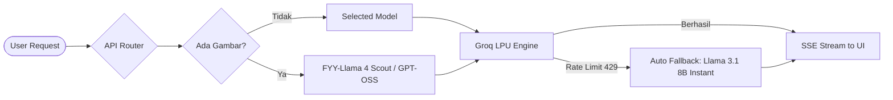

<p align="center">
  
</p>

<h1 align="center">FYY-AI — Multimodal AI Platform</h1>

<p align="center">
  <strong>The Ultimate All-in-One AI Ecosystem: Ultra-Fast Groq LPU Inference, Live Voice Calls, Multimodal Vision, AI Image Studio & Native Android Integration.</strong>
</p>

<p align="center">
  <a href="https://github.com/RapXCode1/fyy-ai"></a>
  <a href="https://fyy-ai.vercel.app"></a>
  
  
  
  
  
  
  
  
</p>

---

## 🌟 Overview

**FYY-AI** adalah platform kecerdasan buatan (AI) generasi masa depan yang dirancang dan dikembangkan secara mandiri oleh **[RapXCode](https://github.com/RapXCode1)**. Platform ini menggabungkan kecepatan inferensi luar biasa dari **Groq LPU**, model penalaran mutakhir (Llama 3.3, Llama 4 Scout, GPT-OSS 120B, Qwen 3 32B), sistem panggilan suara interaktif real-time (*Live Voice Call*), studio generasi gambar AI (*AI Image Studio*), analisis visi dokumen multimodal, hingga integrasi aplikasi mobile native Android via **Capacitor 8**.

Mengusung tema aksen kebangsaan **Merah Putih (Crimson Red & Crisp White Glow)** berpadu dengan estetika futuristik modern, **FYY-AI** memberikan pengalaman asisten cerdas yang sangat responsif, elegan, dan tanpa kompromi.

---

## 📑 Daftar Isi

- [✨ Fitur Utama (Core Features)](#-fitur-utama-core-features)
- [🤖 Model AI & Sistem Inferensi](#-model-ai--sistem-inferensi)
- [🎯 Mode Asisten AI (Specialized Modes)](#-mode-asisten-ai-specialized-modes)
- [🎙️ Live Voice Call & Voice I/O](#️-live-voice-call--voice-io)
- [🎨 AI Image Studio & Prompt Enhancer](#-ai-image-studio--prompt-enhancer)
- [🔐 Sistem Autentikasi, Keamanan & Guest Trial](#-sistem-autentikasi-keamanan--guest-trial)
- [📱 Aplikasi Mobile & Android (Capacitor 8)](#-aplikasi-mobile--android-capacitor-8)
- [🎨 Desain Sistem & Tema](#-desain-sistem--tema)
- [🏛️ Arsitektur Sistem](#️-arsitektur-sistem)
- [🗂️ Struktur Direktori Proyek](#️-struktur-direktori-proyek)
- [🚀 Panduan Memulai (Quick Start)](#-panduan-memulai-quick-start)
- [⚙️ Konfigurasi Environment Variables](#️-konfigurasi-environment-variables)
- [📡 Dokumentasi API Endpoints](#-dokumentasi-api-endpoints)
- [👨‍💻 Profil Developer & Branding](#-profil-developer--branding)
- [📜 Lisensi](#-lisensi)

---

## ✨ Fitur Utama (Core Features)

| Kategori | Fitur & Deskripsi |
|---|---|
| ⚡ **Inferensi Kilat (LPU)** | Streaming respons secepat kilat memanfaatkan Groq LPU engine berbasis Server-Sent Events (SSE). |
| 🧠 **Multi-Model Selector** | Bebas beralih antar model AI tier-atas: **FYY-Llama 3.3**, **FYY-Llama 4 Scout**, **FYY-GPT-OSS 120B**, dan **FYY-Qwen 3 32B**. |
| 🎙️ **Live Voice Modal (Call Mode)** | Fitur panggilan suara interaktif mirip manusia dengan visualisasi orb bercahaya real-time dan echo-cancellation cooldown. |
| 🗣️ **Voice I/O & Text-to-Speech** | Dukungan input suara (Web Speech Recognition) dan output suara asisten cerdas dengan pengaturan kecepatan & jenis suara. |
| 👁️ **Multimodal Vision & Dokumen** | Analisis gambar, tangkapan layar, grafik, dan lampiran dokumen secara instan. |
| 🎨 **AI Image Studio** | Studio generasi gambar AI terintegrasi berbasis **FLUX.1-schnell**, **FLUX.1-dev**, dan **Stable Diffusion XL**. |
| 🪄 **AI Prompt Enhancer** | Otomatisasi penerjemahan dan penyempurnaan prompt bahasa Indonesia/kasual ke prompt profesional berbahasa Inggris via Groq LLaMA. |
| 🗂️ **Riwayat Percakapan Persisten** | Sinkronisasi riwayat chat lokal via `localStorage` dan cloud database berbasis **Supabase PostgreSQL**. |
| 🌗 **Multi-Theme Engine** | Pilihan tema fleksibel: Dark, Light, Cyberpunk, Merah Putih, Glassmorphism, dan Neobrutalism. |
| 🛡️ **Guest Trial & Clerk Security** | Mode Tamu (Guest Mode) dengan kuota 20 chat & 10 generate gambar, terproteksi Clerk Security Shield. |
| 🔓 **Owner Mode (FyyXD Secret Mode)** | Persona rahasia khusus developer (RapXCode) yang dapat dibuka dengan kode `FYY3257`. |
| 📱 **Native Android & PWA** | Kemasan APK Android native dengan Capacitor 8, splash screen, haptics, keyboard adaptif, dan PWA installable. |

---

## 🤖 Model AI & Sistem Inferensi

FYY-AI mengintegrasikan mesin inferensi cerdas dengan arsitektur failover otomatis:



### Daftar Model yang Tersedia:

1. **`llama-3.3-70b-versatile` — FYY-Llama 3.3 (Complete)**  
   *Model andalan performa tinggi untuk penalaran mendalam, analisis teks panjang, dan coding.*
2. **`meta-llama/llama-4-scout-17b-16e-instruct` — FYY-Llama 4 Scout**  
   *Model generasi terbaru dengan penalaran adaptif dan dukungan analisis multimodal/gambar.*
3. **`openai/gpt-oss-120b` — FYY-GPT-OSS 120B**  
   *Model open-weights berskala raksasa 120B untuk tugas-tugas penalaran dan riset kompleks.*
4. **`qwen/qwen3-32b` — FYY-Qwen 3 32B**  
   *Model multilingual canggih dengan kapabilitas matematika, logika, dan struktur kode presisi.*
5. **`llama-3.1-8b-instant` — Fallback Failover Guard**  
   *Model cadangan ultra-cepat yang otomatis aktif saat kuota model utama mengalami rate-limit.*

---

## 🎯 Mode Asisten AI (Specialized Modes)

Pengguna dapat memilih spesialisasi asisten melalui **Mode Selector**:

- 🤖 **General Assistant**: Asisten serba bisa untuk percakapan harian, tanya jawab umum, dan produktivitas harian.
- ✍️ **Creative Writer**: Spesialis narasi kreatif, penulisan artikel, puisi, storytelling, dan strategi copywriting.
- 💻 **Code Expert**: Pakar pemrograman full-stack, debugging error, arsitektur software, dan optimasi algoritma.
- 🔍 **Research Pro**: Analisis riset mendalam, pembedahan data, ekstraksi poin penting, dan sintesis fakta terstruktur.
- 🎨 **Image Studio**: Antarmuka khusus untuk kreasi seni digital dan prompt crafting.

---

## 🎙️ Live Voice Call & Voice I/O

FYY-AI menghadirkan pengalaman berbicara langsung dengan asisten AI tanpa perlu mengetik:

- **Live Voice Modal**: Membuka sesi panggilan suara penuh dengan animasi bola energi bercahaya (*energy orb*):
  - ⚪ **Listening State (Glow Putih)**: Menandakan AI sedang mendengarkan ucapan pengguna.
  - 🔵 **Speaking/Idle State (Pulse Biru)**: Menandakan AI sedang berbicara atau menunggu jeda.
- **Smart Conversational System**: Saat Live Voice aktif, instruksi sistem secara otomatis beralih menjadi jawaban ringkas, alami (1-3 kalimat), dan tanpa format markdown berat agar suara terdengar seperti panggilan telepon nyata.
- **Echo Prevention Mechanism**: Dilengkapi dengan jeda pendinginan (*TTS Cooldown*) agar suara output AI tidak memicu mikrofon kembali.

---

## 🎨 AI Image Studio & Prompt Enhancer

Studio pembuatan gambar AI generasi mutakhir dengan model difusi HuggingFace:

- **Model Pilihan**:
  - `FLUX.1-schnell` — Generasi instan dengan detail tajam.
  - `FLUX.1-dev` — Generasi resolusi tinggi dengan kualitas fotorealistik profesional.
  - `Stable Diffusion XL Base 1.0` — Model klasik untuk ilustrasi artistik, anime, dan konsep seni.
- **Groq AI Prompt Enhancer**: Pengguna dapat mengetikkan deskripsi dalam bahasa Indonesia sederhana (misal: *"kucing cyberpunk pakai kacamata neon"*). FYY-AI akan otomatis menerjemahkan dan mengembangkannya menjadi prompt difusi profesional berstandar industri secara instan sebelum dikirim ke mesin rendering.
- **Media Gallery**: Galeri gambar interaktif untuk mengunduh, melihat resolusi penuh, dan menyalin tautan gambar.

---

## 🔐 Sistem Autentikasi, Keamanan & Guest Trial

- **Clerk Authentication**: Manajemen pengguna berbasis OAuth (Google, GitHub, Email/Password) dengan perlindungan sesi dan token aman.
- **Clerk Security Shield**: Komponen pelindung otomatis di layer klien untuk mencegah pembobolan state dan render error.
- **Guest Mode (Mode Tamu)**:
  - Pengguna tanpa login dapat langsung mencoba FYY-AI.
  - Kuota trial: **20 Chat Messages** dan **10 AI Image Generations**.
  - Saat batas tercapai, sistem secara elegan memandu pengguna untuk mendaftar akun gratis.
- **Owner Mode (`FYY3257` / FyyXD)**:
  - Mode tersembunyi khusus untuk sang pencipta (**RapXCode**).
  - Mengaktifkan persona **FyyXD** berkarakter Gen-Z, kocak, tanpa filter restriksi, dan mengenali RapXCode sebagai satu-satunya arsitek sistemnya.

---

## 📱 Aplikasi Mobile & Android (Capacitor 8)

FYY-AI dapat dijalankan sebagai aplikasi native Android (.apk) menggunakan **Capacitor 8**:

```mermaid
graph TD
    A[Next.js App Router] -->|Capacitor Bridge| B[Android WebView]
    B --> C[@capacitor/browser OAuth Auth]
    B --> D[@capacitor/app Lifecycle]
    B --> E[@capacitor/haptics Vibration]
    B --> F[@capacitor/keyboard Native Keyboard]
    B --> G[@capacitor/splash-screen & status-bar]
```

### Konfigurasi Mobile:
- **System Browser Auth (`@capacitor/browser`)**: Alur login Clerk di perangkat mobile dialihkan ke browser sistem untuk keamanan tinggi dan dikembalikan ke aplikasi melalui custom deep-link (`fyyai://`).
- **Adaptif UI**: Sidebar mobile responsif, tombol voice input yang ramah sentuhan, dan status bar yang menyatu dengan warna tema aplikasi.

---

## 🎨 Desain Sistem & Tema

Desain FYY-AI mengusung filosofi **Aesthetics & Performance**:

- **National Merah Putih Glow Theme**:
  - Warna primer: `Crimson Red (#E11D48 / #BE123C)`
  - Warna sekunder: `Crisp White Glow (#FFFFFF / rgba(255,255,255,0.95))`
  - Latar belakang: Deep Obsidian Dark (`#08080A` / `#060816`)
- **Varian Tema Lengkap**:
  - `dark` / `light` — Mode standar modern.
  - `glass` — Efek Glassmorphism dengan blur backdrop dinamis.
  - `neobrutalism` — Garis kontras tegas dengan bayangan pop-art.
  - `cyberpunk`, `ocean`, `nature`, `retro`, `sunset`, `minimal`.

---

## 🏛️ Arsitektur Sistem

```
┌────────────────────────────────────────────────────────┐
│                    Client Browser / APK                │
│  (Next.js 16 + React 19 + Tailwind v4 + Framer Motion) │
└───────────┬────────────────────────────────┬───────────┘
            │                                │
            ▼                                ▼
┌──────────────────────┐          ┌──────────────────────┐
│   Clerk Security     │          │  Next.js API Routes  │
│   Authentication     │          │  (Edge / Serverless) │
└──────────────────────┘          └──────────┬───────────┘
                                             │
      ┌──────────────────┬───────────────────┼──────────────────┐
      ▼                  ▼                   ▼                  ▼
┌───────────┐      ┌───────────┐       ┌───────────┐      ┌───────────┐
│ Groq LPU  │      │HuggingFace│       │ Supabase  │      │ Capacitor │
│ Inference │      │ Diffusion │       │PostgreSQL │      │ Android 8 │
└───────────┘      └───────────┘       └───────────┘      └───────────┘
```

---

## 🗂️ Struktur Direktori Proyek

```
fyy-ai/
├── android/                    # Proyek Native Android (Capacitor)
├── app/                        # Next.js App Router
│   ├── api/                    # Backend API Endpoints
│   │   ├── analyze/document/   # Endpoint analisis dokumen/file
│   │   ├── chat/               # Endpoint chat completion Groq (SSE)
│   │   ├── image/generate/     # Endpoint generasi gambar HuggingFace
│   │   ├── models/             # Endpoint daftar model AI
│   │   ├── settings/           # Endpoint sinkronisasi pengaturan
│   │   ├── site-links/         # Endpoint navigasi otomatis footer
│   │   └── welcome/            # Endpoint generator sambutan AI
│   ├── chat/                   # Halaman Workspace Chat Utama
│   ├── developer/              # Halaman Profil Developer (RapXCode)
│   ├── docs/                   # Halaman Dokumentasi Interaktif
│   ├── privacy/                # Halaman Kebijakan Privasi
│   ├── terms/                  # Halaman Syarat & Ketentuan
│   ├── sign-in/ & sign-up/     # Halaman Autentikasi Clerk
│   ├── layout.tsx              # Root Layout & Provider Setup
│   ├── page.tsx                # Landing Page Premium FYY-AI
│   └── globals.css             # Desain Sistem & Variabel CSS
│
├── components/
│   ├── animations/             # Komponen animasi & Framer Motion
│   │   ├── animated-progress-bar.tsx
│   │   ├── fade-in-section.tsx
│   │   ├── framer-animations.tsx
│   │   └── welcome-animation.tsx
│   ├── chat/                   # Komponen Antarmuka Chat
│   │   ├── chat-input.tsx      # Bar input pesan, file, suara, & live call
│   │   ├── chat-sidebar.tsx    # Sidebar riwayat chat & navigasi
│   │   ├── file-upload.tsx     # Handler upload & preview lampiran
│   │   ├── image-generator.tsx # Studio kreasi gambar AI
│   │   ├── live-voice-modal.tsx# Modal panggilan suara real-time
│   │   ├── media-gallery.tsx   # Galeri media gambar
│   │   ├── message-list.tsx    # Render list gelembung pesan chat
│   │   ├── model-selector.tsx  # Pemilih model AI
│   │   ├── modes-selector.tsx  # Pemilih mode asisten
│   │   ├── quick-prompts.tsx   # Kartu rekomendasi prompt cepat
│   │   ├── settings-panel.tsx  # Panel pengaturan AI & parameter
│   │   ├── speech-output.tsx   # Komponen output text-to-speech
│   │   ├── text-formatter.tsx  # Markdown, Codeblock & LaTeX Formatter
│   │   └── voice-input.tsx     # Web Speech Recognition Handler
│   ├── ui/                     # UI Primitives (Radix UI / Shadcn)
│   ├── clerk-security-shield.tsx
│   ├── client-only-providers.tsx
│   ├── service-worker-register.tsx
│   ├── theme-provider.tsx
│   ├── theme-style-provider.tsx
│   └── theme-toggle.tsx
│
├── hooks/                      # Custom React Hooks
│   ├── use-file-upload.ts
│   ├── use-scroll-animation.ts
│   └── use-voice-input.ts
│
├── lib/                        # Utility & Core Logics
│   ├── ai-modes.ts             # Definisi mode asisten AI
│   ├── api-config.ts           # Konfigurasi & Healthcheck API
│   ├── input-validation.ts     # Validasi skema input (Zod)
│   ├── openSignIn.ts           # Helper alur autentikasi mobile
│   ├── settings.ts             # Global system settings & state
│   ├── supabase.ts             # Inisialisasi klien Supabase
│   └── utils.ts                # Classnames merge helper (cn)
│
├── public/                     # Aset statis & logo FYY-AI
├── styles/themes/              # File style tema tambahan (Glass, Neobrutalism, Basic)
├── capacitor.config.ts         # Konfigurasi Capacitor Mobile
├── next.config.mjs             # Konfigurasi Next.js
└── package.json                # Dependensi & script proyek
```

---

## 🚀 Panduan Memulai (Quick Start)

### 1. Kebutuhan Sistem
- **Node.js**: Versi `>= 20.x`
- **npm**: Versi `>= 10.x`
- **Git**: Terpasang di sistem

### 2. Kloning Repository
```bash
git clone https://github.com/RapXCode1/fyy-ai.git
cd fyy-ai
```

### 3. Instalasi Dependensi
```bash
npm install
```

### 4. Konfigurasi Environment Variables
Salin file `.env.example` menjadi `.env.local`:
```bash
cp .env.example .env.local
```
Lengkapi API key yang dibutuhkan di dalam file `.env.local` (lihat bagian [Konfigurasi Environment Variables](#️-konfigurasi-environment-variables)).

### 5. Menjalankan Server Development
```bash
npm run dev
```
Buka browser dan akses: **`http://localhost:3000`**

### 6. Build untuk Produksi
```bash
npm run build
npm start
```

---

## ⚙️ Konfigurasi Environment Variables

File `.env.local` memerlukan konfigurasi berikut:

```env
# ==========================================
# 1. INFERENSI AI (GROQ LPU) - WAJIB
# Dapatkan API key di: https://console.groq.com/keys
# ==========================================
GROQ_API_KEY=gsk_xxxxxxxxxxxxxxxxxxxxxxxxxxxx

# ==========================================
# 2. AUTENTIKASI (CLERK) - WAJIB UNTUK LOGIN
# Dapatkan API keys di: https://dashboard.clerk.com
# ==========================================
NEXT_PUBLIC_CLERK_PUBLISHABLE_KEY=pk_test_xxxxxxxxxxxxxxxx
CLERK_SECRET_KEY=sk_test_xxxxxxxxxxxxxxxx
NEXT_PUBLIC_CLERK_SIGN_IN_URL=/sign-in
NEXT_PUBLIC_CLERK_SIGN_UP_URL=/sign-up
NEXT_PUBLIC_CLERK_AFTER_SIGN_IN_URL=/chat
NEXT_PUBLIC_CLERK_AFTER_SIGN_UP_URL=/chat

# ==========================================
# 3. GENERASI GAMBAR AI (HUGGINGFACE) - OPSIONAL
# Dapatkan token di: https://huggingface.co/settings/tokens
# ==========================================
HUGGINGFACE_API_TOKEN=hf_xxxxxxxxxxxxxxxxxxxxxxxxxxxx

# ==========================================
# 4. DATABASE & RIWAYAT CHAT (SUPABASE) - OPSIONAL
# Dapatkan kredensial di: https://supabase.com/dashboard
# ==========================================
NEXT_PUBLIC_SUPABASE_URL=https://your-project.supabase.co
NEXT_PUBLIC_SUPABASE_ANON_KEY=your-anon-key
```

---

## 📡 Dokumentasi API Endpoints

### 1. Chat Completion (`POST /api/chat`)
Endpoint streaming Server-Sent Events (SSE) untuk interaksi pesan dengan AI.

- **Request Body**:
  ```json
  {
    "messages": [
      { "role": "user", "content": "Halo Fyy-AI!" }
    ],
    "model": "llama-3.3-70b-versatile",
    "mode": "general",
    "isLiveMode": false,
    "isGuest": false
  }
  ```
- **Response**: Text Event Stream (`text/event-stream`).

### 2. AI Image Generation (`POST /api/image/generate`)
Endpoint pembuatan gambar AI dengan optimasi prompt otomatis via Groq.

- **Request Body**:
  ```json
  {
    "prompt": "Lukisan pemandangan candi Borobudur bernuansa cyberpunk neon",
    "model": "flux",
    "width": 1024,
    "height": 1024
  }
  ```
- **Response**: Binary image stream (`image/jpeg` atau `image/png`).

### 3. List AI Models (`GET /api/models`)
Mengembalikan daftar model AI yang aktif dan siap digunakan.

---

## 📱 Build Android Native (Capacitor)

Untuk mengompilasi aplikasi ke format APK Android:

1. **Sinkronkan aset web ke folder Android**:
   ```bash
   npm run build
   npx cap sync android
   ```
2. **Buka project di Android Studio**:
   ```bash
   npx cap open android
   ```
3. Di Android Studio, pilih menu **Build > Build Bundle(s) / APK(s) > Build APK(s)**.

---

## 👨‍💻 Profil Developer & Branding

<p align="center">
  
</p>

**FYY-AI** dirancang, dikembangkan, dan dipelihara secara mandiri oleh:

### **RapXCode (Rhafi Al Ghifari)**
*Full-Stack Systems Architect & AI Specialist*

- 🌐 **GitHub**: [@RapXcode1](https://github.com/RapXcode1)
- 📸 **Instagram**: [@rhafialghfr_](https://instagram.com/rhafialghfr_)
- 📧 **Email**: [rapxcode1@gmail.com](mailto:rapxcode1@gmail.com)
- 💻 **Portfolio & Developer Bio**: Kunjungi langsung di aplikasi pada menu [Developer Page](https://fyy-ai.vercel.app/developer).

---

## 📜 Lisensi

Proyek ini dilisensikan di bawah lisensi open-source **[MIT License](LICENSE)**.  
Bebas digunakan, dimodifikasi, dan dikembangkan lebih lanjut dengan tetap menyertakan atribusi ke **RapXCode**.

---

<p align="center">
  <strong>⚡ FYY-AI — Built with Passion, Precision & Indonesian Merah Putih Pride by RapXCode © 2026 ⚡</strong>
</p>
